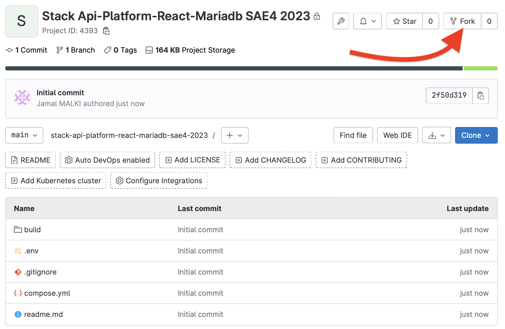

<h1>Stack de développement Api-Platform-React-Mariadb de la SAE4</h1>

**Contenu :**

- [Prérequis](#prérequis)
- [Démarrage](#démarrage)
  - [1. Forker le modèle de stack](#1-forker-le-modèle-de-stack)
  - [2. Cloner la stack du projet](#2-cloner-la-stack-du-projet)
  - [3. Démarrer la stack du projet](#3-démarrer-la-stack-du-projet)
- [Initialiser le service Api-Platform `sae4api`](#initialiser-le-service-api-platform-sae4api)
- [Initialiser le service React `sae4app`](#initialiser-le-service-react-sae4app)
- [Partager le projet](#partager-le-projet)
- [Contenu de la docker stack](#contenu-de-la-docker-stack)
  - [fichier .env](#fichier-env)
  - [Fichier .gitignore](#fichier-gitignore)
  - [dossier build](#dossier-build)
    - [database](#database)
    - [nginx](#nginx)
    - [sae4api](#sae4api)


## Prérequis

Sur votre machine Mac, Windows ou Linux :

- Docker 20.20 au moins
- (Docker) Compose  
  (Installer Docker Desktop satisfait ces deux pré-requis)
- Un éditeur de texte ou un IDE
- L'accès à un terminal

De manière optionnelle, mais fortement recommandée :

- Une [clé SSH](https://forge.iut-larochelle.fr/help/ssh/index#generate-an-ssh-key-pair) active sur votre machine
  (perso) et [ajoutée dans votre compte gitlab](https://forge.iut-larochelle.fr/help/ssh/index#add-an-ssh-key-to-your-gitlab-account) :  
  elle vous permettra de ne pas taper votre mot de passe en permanence.
- PHPStorm  
  _Votre email étudiant vous permet de bénéficier d'une licence complète de 12 mois pour tous les produits JetBrains_  
  ...Mais vous pouvez bien sûr utiliser l'IDE de votre choix.

## Démarrage

### 1. Forker le modèle de stack

**UN.E SEUL.E** des développeuses/développeurs de votre équipe va **fork** le présent dépôt, pour en créer un nouveau, 
dans le groupe correspondant à votre équipe :  
_Par exemple pour l'équipe 3 du groupe de TP X1, le groupe est :_ `SAE34-BUT-2022/x1/eq3`

<div align="center" ></div>

**Remarque** : 
>Il n'est pas nécessaire de conserver le lien avec le modèle de stack, vous pouvez donc aller dans  
> Settings > General > Advanced (dans Gitlab) pour supprimer le "Fork relationship" de votre projet


### 2. Cloner la stack du projet 

Le membre de l'équipe qui a réalisé le fork, doit cloner ce nouveau dépôt sur son poste de travail 

⚠️ **Si vous êtes sous Linux**  
> Avant de démarrer la stack, il faut renseigner les variables qui se trouvent dans le fichier `.env` à la racine du dépôt     
> Vous pouvez obtenir l'id de votre user (et de son groupe) en lançant la commande `id -u ${USER}` dans un terminal

### 3. Démarrer la stack du projet 

Dans un terminal positionné dans le dossier de la stack du projet : 

- Créer le dossier de l'api 
```
mkdir sae4api
```
- démarrer la stack    
```
docker compose up --build -d
```

- inspecter l'état des services 
```
docker compose ps
```

**Remarque**                  
Si vous avez  le message d'erreur : 
```
Error response from daemon: invalid mount config for type "bind": bind source path does not exist: /../../stack-api-platform-react-mariadb-sae4-2023/sae4api
```
C'est que vous n'avez pas créer le dossier `sae4api`


## Initialiser le service Api-Platform `sae4api`

Dans un terminal positionné dans le dossier de la stack du projet : 
 
 - on se connecte au conteneur associé su service `sae4api` 
```bash
docker compose exec sae4api bash
```
- après connexion, on doit être dans `/app`, vérifier 
```
pwd 
```
- créer le projet `sae4api`
```
composer create-project symfony/skeleton:"^5.4" sae4api
```

- vérifier l'exécution du service `sae4api`
```
localhost:8000
```

## Initialiser le service React `sae4app`

Un projet react, créé via Create-React-App par défaut est déjà disponible dans le dossier `sae4app` du dépôt.

Si vous souhaitez ajouter des dépendances : 

- on se connecte au conteneur associé su service `sae4app` 

```bash
docker compose exec sae4app bash
```
- après connexion, on doit être dans `/app`, vérifier 

- installer les dépendances 

```bash
npm install --save <nom-de-la-dépendance> # ou --save-dev pour une dépendance de développement
```

- vérifier l'exécution du service `sae4app` : [http://localhost:3000](http://localhost:3000)

**Remarque**       
Il se peut que le projet React `sae4app` ne démarre pas, dans ce cas contacter votre TonTon DEV. 

## Partager le projet

À ce stade, les services `sae4api` et `sae4app` sont créés et démarrés, autrement dit fonctionnels, alors : 
- on fait `commit` et `push` pour partager avec les autres membres de l'équipe
- on déclare tout les membres de l'équipe dans le dépôt du projet avec le rôle `Developer` (si ce n'est pas déjà fait :-))
- chaque membre de l'équipe peut alors 
  - cloner ce nouveau dépôt sur son poste de travail 
  - démarrer toute la stack docker du projet 

## Contenu de la docker stack 
```
.
├── .env
├── .gitignore
├── build
│   ├── database
│   │   ├── Dockerfile
│   │   └── myconf.cnf
│   ├── nginx
│   │   ├── Dockerfile
│   │   └── default.conf
│   └── sae4api
│   │   ├── Dockerfile
│   │   └── default.ini
│   └── sae4app
│       └── Dockerfile
│       
└── compose.yml
```

### fichier .env 
Ce fichier déclare des variables d'environnement.    
Ces variables définissent l'utilisateur qui exécute la stack docker.     
On définit les valeurs de ces variables uniquement si on est sous **LINUX**.     
Par défaut, ces variables sont commentées. 

Exemple : 
```
USER_NAME=jmalki
USER_ID=1000
GROUP_NAME=jmalki
GROUP_ID=1000
```

### Fichier .gitignore
Ce fichier déclare tous les artefacts du projet qui ne doivent pas être poussés dans le repository gitlab distant. 

### dossier build 

#### database
On utilise une base de données de type `mariadb-10.10.2`.     
L'image docker se trouve dans la registry de l'IUT.    
On ajoute un fichier de configuration.    

Le Dockerfile : 
```
FROM forge-registry.iut-larochelle.fr/mariadb/mariadb-10.10.2
COPY ./build/database/myconf.cnf /etc/mysql/conf.d/.
```

#### nginx 
On utilise un serveur web de type `nginx-1.23.3`.     
L'image docker se trouve dans la registry de l'IUT.    
On ajoute un fichier de configuration du host qui permet l'accès à notre application.     
Dans le conteneur, on crée le dossier `/app` qui va contenir le code source de notre application.     

Le Dockerfile : 
```
FROM forge-registry.iut-larochelle.fr/nginx/nginx-1.23.3
COPY ./build/nginx/default.conf /etc/nginx/conf.d/default.conf
RUN mkdir /app
```

#### sae4api 
On utilise un environement de développement basé sur `php-7.4-fpm`.    
Cet environement contient un `composer` version 2.     
L'image docker se trouve dans la registry de l'IUT.    
Au démarrage du conteneur de cette image : 
- on se met dans l'environement `dev` (pour Symfony)
- on se loge en tant que `root` pour exécuter quelques commandes système
- on surcharge quelques variables pour PHP et Symfony
- on se positionne dans le dossier `/app` 
- si on est sous LINUX, on crée l'utilisateur qui va exécuter le conteneur 
- on se loge en tant que l'utilisateur créé, sinon c'est l'utilisateur `root` (dans le cas de Mac et Windows)


Le Dockerfile : 
```
FROM forge-registry.iut-larochelle.fr/php-fpm-composer/php7.4-fpm-composer

# Login to container as root user
USER root

# Symfony dev environement 
ENV APP_ENV=dev

# Copy php default configuration
COPY ./build/sae4api/default.ini /usr/local/etc/php/conf.d/default.ini

# Set working directory
WORKDIR /app 

# Arguments defined in compose.yml
ARG USER_NAME
ARG USER_ID
ARG GROUP_NAME
ARG GROUP_ID

# Create system user to run Composer and PHP Commands
RUN if [ ! -z ${USER_NAME} ] && [ ! -z ${GROUP_NAME} ] && [ ${USER_ID:-0} -ne 0 ] && [ ${GROUP_ID:-0} -ne 0 ] ; then \
    useradd -G www-data,root -u $USER_ID -d /home/$USER_NAME $USER_NAME && \
    mkdir -p /home/$USER_NAME/.composer  && \
    chown -Rf ${USER_NAME}:${GROUP_NAME} /home/$USER_NAME  && \
    chown -R ${USER_NAME}:${GROUP_NAME} /app \
    ; fi

# Login to container as non-root user 
USER ${USER_ID:-0}:${GROUP_ID:-0}
```
